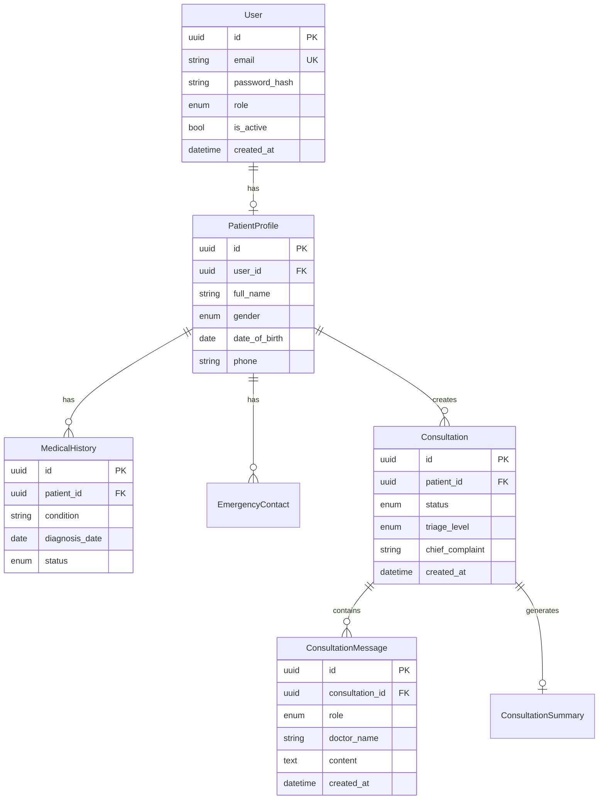

# OCEGS 系统开发规划

> **Online Consultation and Emergency Guidance System**  
> 在线问诊与紧急指导系统 - 综合数字医疗平台
> 
> 🎯 **使命**: 为无力获得良好医疗资源的人们提供AI驱动的医疗咨询服务

---

## 📌 技术决策确认

| 决策项 | 选择 | 理由 |
|-------|------|------|
| **后端语言** | Python (FastAPI) | AI集成友好，异步性能强，生态丰富 |
| **数据库** | PostgreSQL | 关系型数据完整性，医疗数据合规 |
| **实时通信** | WebSocket (Socket.IO) | 实时聊天，V1暂不做视频 |
| **V1 范围** | 核心问诊 + 聊天 | 聚焦AI问诊核心价值 |

---

## 🏗️ 项目结构

```
OCEGS/
├── backend/                          # Python FastAPI 后端
│   ├── app/
│   │   ├── main.py                   # FastAPI 入口
│   │   ├── config.py                 # 配置管理
│   │   ├── database.py               # PostgreSQL 连接
│   │   │
│   │   ├── auth/                     # 认证模块
│   │   │   ├── router.py
│   │   │   ├── schemas.py
│   │   │   ├── services.py
│   │   │   └── jwt.py
│   │   │
│   │   ├── users/                    # 用户管理
│   │   │   ├── router.py
│   │   │   ├── models.py
│   │   │   ├── schemas.py
│   │   │   └── services.py
│   │   │
│   │   ├── patients/                 # 患者档案
│   │   │   ├── router.py
│   │   │   ├── models.py             # Profile, History, EmergencyContacts
│   │   │   ├── schemas.py
│   │   │   └── services.py
│   │   │
│   │   ├── ai_doctor/                # 🔥 AI医生核心模块
│   │   │   ├── router.py
│   │   │   ├── triage.py             # 分诊系统
│   │   │   ├── consultation.py       # AI问诊核心 (复用ai-doctor逻辑)
│   │   │   ├── prompts.py            # 提示词系统 (复用)
│   │   │   └── providers/            # AI供应商
│   │   │       ├── base.py
│   │   │       ├── openai.py
│   │   │       ├── anthropic.py
│   │   │       ├── gemini.py
│   │   │       └── siliconflow.py
│   │   │
│   │   ├── chat/                     # 实时聊天模块
│   │   │   ├── router.py
│   │   │   ├── websocket.py
│   │   │   └── models.py
│   │   │
│   │   ├── emergency/                # 紧急指导
│   │   │   ├── router.py
│   │   │   ├── guidance.py
│   │   │   └── protocols.py          # 急救协议库
│   │   │
│   │   └── notifications/            # 通知服务
│   │       ├── router.py
│   │       ├── alerts.py
│   │       └── caretaker.py
│   │
│   ├── alembic/                      # 数据库迁移
│   ├── tests/
│   ├── requirements.txt
│   └── Dockerfile
│
├── frontend/                         # Vue 3 前端
│   ├── src/
│   │   ├── main.js
│   │   ├── App.vue
│   │   ├── router/
│   │   ├── stores/                   # Pinia 状态管理
│   │   │   ├── auth.js
│   │   │   ├── patient.js
│   │   │   ├── consultation.js       # 复用ai-doctor状态逻辑
│   │   │   └── chat.js
│   │   ├── api/                      # API 调用
│   │   │   ├── http.js
│   │   │   ├── auth.js
│   │   │   ├── patient.js
│   │   │   ├── aiDoctor.js           # 复用callAI逻辑
│   │   │   └── chat.js
│   │   ├── components/
│   │   │   ├── common/
│   │   │   ├── consultation/         # 问诊相关组件
│   │   │   ├── chat/                 # 聊天组件 (复用ChatDisplay)
│   │   │   └── patient/              # 患者档案组件
│   │   ├── views/
│   │   │   ├── auth/
│   │   │   ├── patient/
│   │   │   ├── consultation/
│   │   │   └── emergency/
│   │   └── utils/
│   ├── package.json
│   └── vite.config.js
│
├── ai-doctor-refrence/               # 参考项目 (保留)
├── ai-doctor-refrence-analysis.md    # 参考项目分析文档
└── OCEGS_Plan.md                     # 本规划文档
```

---

## 📋 开发步骤

### Step 1: 项目初始化与基础架构

**目标**: 搭建可运行的前后端骨架

**后端任务**:
- [x] 初始化 FastAPI 项目结构
- [x] 配置 PostgreSQL 连接 (SQLAlchemy + asyncpg)
- [x] 配置 Alembic 数据库迁移
- [x] 实现基础健康检查 API
- [x] 配置 CORS、日志、错误处理

**前端任务**:
- [x] 初始化 Vue 3 + Vite 项目
- [x] 配置 Pinia、Vue Router、Ant Design Vue
- [x] 创建基础布局组件
- [x] 配置 Axios HTTP 客户端

**交付物**:
- 后端 `/health` 接口可访问
- 前端首页可渲染
- 前后端可联调

---

### Step 2: 用户认证系统

**目标**: 完整的注册、登录、权限控制

**数据库模型**:
```python
class User(Base):
    id: UUID
    email: str (unique)
    password_hash: str
    role: Enum[PATIENT, DOCTOR, CARETAKER, ADMIN]
    is_active: bool
    created_at: datetime
    updated_at: datetime
```

**后端任务**:
- [ ] User 模型与表创建
- [ ] 注册 API (密码加密 bcrypt)
- [ ] 登录 API (JWT 生成)
- [ ] Token 刷新机制
- [ ] 权限装饰器/依赖注入
- [ ] 当前用户 API

**前端任务**:
- [ ] 登录/注册页面
- [ ] Token 存储与自动刷新
- [ ] 路由守卫
- [ ] 用户状态管理 (Pinia)

**交付物**:
- 用户可注册/登录
- 受保护路由需要登录

---

### Step 3: 患者档案管理

**目标**: 患者基本信息、病史、紧急联系人

**数据库模型**:
```python
class PatientProfile(Base):
    id: UUID
    user_id: FK(User)
    full_name: str
    gender: Enum
    date_of_birth: date
    phone: str
    address: str

class MedicalHistory(Base):
    id: UUID
    patient_id: FK(PatientProfile)
    condition: str           # 疾病名称
    diagnosis_date: date
    status: Enum[ACTIVE, RESOLVED, CHRONIC]
    notes: str

class EmergencyContact(Base):
    id: UUID
    patient_id: FK(PatientProfile)
    name: str
    relationship: str
    phone: str
    is_caretaker: bool       # 是否为照护者(可接收通知)
```

**后端任务**:
- [ ] Patient 相关模型创建
- [ ] CRUD API 实现
- [ ] 关联当前登录用户

**前端任务**:
- [ ] 个人档案页面
- [ ] 病史管理表单
- [ ] 紧急联系人管理

**交付物**:
- 患者可维护个人健康档案

---

### Step 4: AI医生核心模块 (🔥 核心复用)

**目标**: 实现AI问诊功能，复用 ai-doctor 核心逻辑

**复用清单**:

| 源文件 | 目标 | 复用方式 |
|-------|------|---------|
| `api/callAI.js` | `ai_doctor/providers/*.py` | 转Python，保留多供应商逻辑 |
| `utils/prompt.js` | `ai_doctor/prompts.py` | 转Python，保留提示词模板 |
| `store/global.js` 预设提示词 | `ai_doctor/prompts.py` | 12个专科预设 |
| `store/index.js` 状态机 | `ai_doctor/consultation.py` | 会诊流程逻辑 |

**数据库模型**:
```python
class Consultation(Base):
    id: UUID
    patient_id: FK(PatientProfile)
    status: Enum[PENDING, IN_PROGRESS, COMPLETED, CANCELLED]
    triage_level: Enum[EMERGENCY, URGENT, ROUTINE]
    chief_complaint: str     # 主诉
    created_at: datetime
    completed_at: datetime

class ConsultationMessage(Base):
    id: UUID
    consultation_id: FK(Consultation)
    role: Enum[PATIENT, AI_DOCTOR, SYSTEM]
    doctor_name: str         # AI医生名称
    content: str
    created_at: datetime

class ConsultationSummary(Base):
    id: UUID
    consultation_id: FK(Consultation)
    diagnosis: str
    recommendations: str
    generated_by: str        # 生成总结的AI医生
```

**后端任务**:
- [ ] **迁移 AI 调用层**
  - [ ] 基类 `BaseAIProvider`
  - [ ] OpenAI, Anthropic, Gemini, SiliconFlow 实现
- [ ] **迁移提示词系统**
  - [ ] `build_full_prompt()`
  - [ ] `build_vote_prompt()`
  - [ ] `build_final_summary_prompt()`
  - [ ] 12个专科医生预设
- [ ] **实现会诊流程**
  - [ ] 创建问诊 API
  - [ ] 多医生轮询发言
  - [ ] 投票评估机制
  - [ ] 最终总结生成
- [ ] **API Key 管理** (系统配置或用户自有)

**前端任务**:
- [ ] 问诊创建页面 (复用 CaseInputForm 结构)
- [ ] 聊天显示组件 (复用 ChatDisplay)
- [ ] 打字机效果
- [ ] 最终诊断展示

**交付物**:
- 用户可发起AI问诊
- 多AI医生轮流发言
- 生成诊断总结

---

### Step 5: 分诊系统 (Triage)

**目标**: 根据症状自动分类严重程度

**分诊等级**:
```python
class TriageLevel(Enum):
    EMERGENCY = 1    # 紧急 → 立即触发紧急指导
    URGENT = 2       # 急迫 → 优先AI问诊 + 建议就医
    ROUTINE = 3      # 常规 → 标准AI问诊流程
```

**后端任务**:
- [ ] 分诊提示词设计
- [ ] AI驱动的症状分析
- [ ] 关键词匹配规则 (如"胸痛"、"呼吸困难"→EMERGENCY)
- [ ] 分诊结果记录

**前端任务**:
- [ ] 分诊流程引导
- [ ] 紧急情况警告展示
- [ ] 根据分诊结果路由

**交付物**:
- 症状输入后自动分诊
- 紧急情况触发警告

---

### Step 6: 紧急指导模块

**目标**: 紧急情况下提供急救指导

**后端任务**:
- [ ] 急救协议库 (CPR、止血、烧伤等)
- [ ] AI生成针对性急救指导
- [ ] 紧急情况记录

**前端任务**:
- [ ] 紧急指导页面 (大字体、清晰步骤)
- [ ] 一键呼叫紧急联系人
- [ ] 最近医院查询 (可选，使用地图API)

**交付物**:
- 紧急情况下提供急救步骤
- 可通知紧急联系人

---

### Step 7: 实时聊天模块

**目标**: 患者与AI/人工客服的实时聊天

**后端任务**:
- [ ] WebSocket 服务 (FastAPI WebSocket / Socket.IO)
- [ ] 消息持久化
- [ ] 连接管理

**前端任务**:
- [ ] WebSocket 客户端
- [ ] 实时消息组件
- [ ] 消息状态 (发送中/已发送/已读)

**交付物**:
- 实时聊天功能可用

---

### Step 8: 通知与看护者系统

**目标**: 紧急情况通知看护者

**后端任务**:
- [ ] 通知服务 (可先用邮件，后续扩展)
- [ ] 看护者关联患者
- [ ] 紧急事件触发通知

**前端任务**:
- [ ] 通知设置页面
- [ ] 看护者视图 (查看被照护者状态)

**交付物**:
- 紧急情况自动通知看护者

---

## 💾 数据库设计 (PostgreSQL)



---

## 🔄 代码复用详细映射

### 直接复用 (转Python)

```
ai-doctor-refrence/src/api/callAI.js
    ↓ 转换为
backend/app/ai_doctor/providers/
    ├── base.py          # 基类
    ├── openai.py        # callOpenAI → OpenAIProvider.call()
    ├── anthropic.py     # callAnthropic → AnthropicProvider.call()
    ├── gemini.py        # callGemini → GeminiProvider.call()
    └── siliconflow.py   # callSiliconFlow → SiliconFlowProvider.call()
```

```
ai-doctor-refrence/src/utils/prompt.js
    ↓ 转换为
backend/app/ai_doctor/prompts.py
    ├── build_full_prompt()
    ├── build_vote_prompt()
    ├── build_final_summary_prompt()
    └── SPECIALTY_PRESETS = {...}  # 12个专科预设
```

### 前端复用

```
ai-doctor-refrence/src/components/ChatDisplay.vue
    ↓ 适配后复用
frontend/src/components/chat/ChatDisplay.vue

ai-doctor-refrence/src/components/ExpandableText.vue
    ↓ 直接复用
frontend/src/components/common/ExpandableText.vue
```

---

## 🎯 V1 范围定义

### ✅ V1 包含

- 用户注册/登录
- 患者基本档案
- AI问诊 (多医生轮询)
- 分诊分类
- 紧急指导 (基础版)
- 实时聊天
- 看护者通知 (邮件)

### ❌ V1 不包含

- 视频/语音通话
- EMS/911 直接集成
- 移动端 App
- 支付系统
- 多语言支持

---

## 📊 预估工作量

| 步骤 | 模块 | 后端估时 | 前端估时 | 复用度 |
|-----|------|---------|---------|-------|
| Step 1 | 基础架构 | 1-2天 | 1天 | 0% |
| Step 2 | 认证系统 | 2天 | 2天 | 0% |
| Step 3 | 患者档案 | 2天 | 2天 | 0% |
| Step 4 | AI医生 | 3-4天 | 2-3天 | **70%** |
| Step 5 | 分诊系统 | 2天 | 1天 | 20% |
| Step 6 | 紧急指导 | 2天 | 1-2天 | 0% |
| Step 7 | 实时聊天 | 2天 | 2天 | 30% |
| Step 8 | 通知系统 | 2天 | 1天 | 0% |

**总计**: 后端约16-20天，前端约12-14天

---

## 🛠️ 技术栈详细清单

### 后端

```
Python 3.11+
├── FastAPI           # Web框架
├── SQLAlchemy 2.0    # ORM (async)
├── asyncpg           # PostgreSQL异步驱动
├── Alembic           # 数据库迁移
├── Pydantic v2       # 数据验证
├── python-jose       # JWT
├── passlib[bcrypt]   # 密码加密
├── python-multipart  # 文件上传
├── httpx             # 异步HTTP客户端 (AI API调用)
├── websockets        # WebSocket
├── python-socketio   # Socket.IO (可选)
└── uvicorn           # ASGI服务器
```

### 前端

```
Node.js 18+
├── Vue 3.4+          # 框架
├── Pinia             # 状态管理
├── Vue Router 4      # 路由
├── Ant Design Vue 4  # UI组件
├── Vite 5            # 构建工具
├── Axios             # HTTP客户端
├── Socket.IO-client  # 实时通信
└── Marked            # Markdown渲染
```

### 开发工具

```
├── Docker + Docker Compose  # 容器化
├── PostgreSQL 15+           # 数据库
├── Redis (可选)             # 缓存/消息队列
└── Nginx                    # 反向代理
```

---

## 🚀 启动命令参考

```bash
# 后端
cd backend
python -m venv venv
source venv/bin/activate  # Windows: venv\Scripts\activate
pip install -r requirements.txt
alembic upgrade head
uvicorn app.main:app --reload

# 前端
cd frontend
pnpm install
pnpm dev
```

---

> 📅 **文档更新**: 2026-01-05  
> 🎯 **下一步**: 确认规划后开始 Step 1 基础架构搭建
